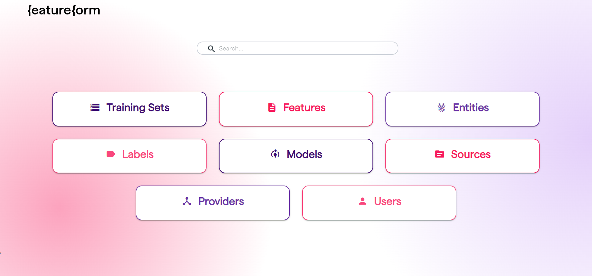

# Interact with the CLI

The Featureform CLI allows you to describe, list, and monitor your resources.

## APPLY Command

The **apply** command submits resource definitions to the Featureform instance.&#x20;

```
featureform apply --host $FEATUREFORM_HOST --cert $FEATUREFORM_CERT <definitions.py>
```

Upon success, all definitions in the **definitions.py** (or whatever you choose to call it) file will be sent to the Featureform instance, logged in the metadata, and materialized with the registered providers.

After applying new resource definitions, you can use the **GET** command to see the status of the resources you applied. A resource with the status **READY** is available for serving.

## DASH Command

```
featureform dash
```

The **DASH** command is used to access the featureform dashboard. It returns a URL to the locally hosted dashboard. 

Example of the dashboard’s URL:

Running on http://localhost:3000/

The Featureform dashboard: 



*Featureform dashboard*

Each button on the dashboard redirects you to a list of resources of that resource type.


*List of registered features*

Each resource can then be clicked on to learn more. 

## GET Command

The **GET** command displays status, variants, and other metadata on a resource.

```
featureform get RESOURCE_TYPE NAME [VARIANT] --host $FEATUREFORM_HOST --cert $FEATUREFORM_CERT
```

**RESOURCE\_TYPE** (required) can be:

* **feature -** machine learning features
* **label -** machine learning labels
* **training-set -** set of features and one label for training ML models
* **user -** registered users in your instance
* **entity -** identifier for a source of features or labels (akin to a primary key)
* **model -** registered machine learning models which training sets and features are fed to
* **provider -** registered 3rd party providers which store your data
* **source -** files, tables, or transformations that features, labels and training sets source from

**NAME** is the name of the resource type to be queried.

**VARIANT** is optional, for when information on a specific variant is needed.

### Example: Getting a User

The commands are both valid ways to retrieve information on the user **"featureformer".**

The first is with certification. The second without; the **--insecure** flag disables the need for the **--cert** flag

```
featureform get user featureformer --host $FEATUREFORM_HOST --cert $FEATUREFORM_CERT
featureform get user featureformer --insecure --host $FEATUREFORM_HOST
```

Either command returns the following output.&#x20;

```
USER NAME:  featureformer

NAME                           VARIANT                             TYPE
avg_transactions               quickstart                          feature
fraudulent                     quickstart                          label
fraud_training                 quickstart                          training set
transactions                   kaggle                              source
average_user_transaction       quickstart                          source
```

Listed below the user are all the resources registered to that user.

### Example: Getting a Resource

The following command shows how to retrieve information on a specific resource, a **feature** named **"avg\_transactions"**.

```
featureform get feature avg_transactions --host $FEATUREFORM_HOST --cert $FEATUREFORM_CERT

NAME:  avg_transactions
STATUS:  NO_STATUS
VARIANTS:
quickstart           default
v1
v2
prodThis would be the output:
```

### Example: Getting a Resource Variant

The command below retrieves information on the specific variant of the **feature** "**avg\_transactions", "quickstart"**

```
featureform get feature avg_transactions quickstart --host $FEATUREFORM_HOST --cert $FEATUREFORM_CERT

NAME:                avg_transactions
VARIANT:             quickstart     
TYPE:                float32
ENTITY:              user
OWNER:               featureformer
DESCRIPTION:
PROVIDER:            redis-quickstart
STATUS:              READY

SOURCE:
NAME                           VARIANT
average_user_transaction       quickstart

TRAINING SETS:
NAME                           VARIANT
fraud_training                 quickstart
```

Listed below are the metadata on that variant, as well as its source and the training sets it belongs to.

## LIST Command

The **LIST** command displays the name, variant and status of all the resources of that resource type. 

```
featureform list RESOURCE_TYPE --host $FEATUREFORM_HOST –cert $FEATUREFORM_CERT
```

**RESOURCE\_TYPE** (required) can be:

* **feature -** machine learning features
* **label -** machine learning labels
* **training-set -** set of features and one label for training ML models
* **user -** registered users in your instance
* **entity -** identifier for a source of features or labels (akin to a primary key)
* **model -** registered machine learning models which training sets and features are fed to
* **provider -** registered 3rd party providers which store your data
* **source -** files, tables, or transformations that features, labels and training sets source from

NOTE: The **--cert $FEATUREFORM_CERT** is only required for self-assigned certs

### Example: Getting the list of users

```
featureform list users --host $FEATUREFORM_HOST --cert $FEATUREFORM_CERT
featureform list users --insecure --host $FEATUREFORM_HOST
```

The commands are both valid ways to retrieve a list of users. The first is when the user self-assigns a cert. 

The following uses the local flag to access resources created and stored in localmode:
```
featureform list users –-local
```

The above commands return the following list of users which have been registered:
```
NAME 							STATUS
default_user					ready
featureformer 					ready
```
 
### Example: Getting the list of resources of a given type

```
featureform list features --host $FEATUREFORM_HOST --cert $FEATUREFORM_CERT
featureform list features --insecure --host $FEATUREFORM_HOST
```

In local mode: 
```
featureform list features –-local
```

The given commands return the list of registered features and their variants
```
NAME 						VARIANT 						STATUS
avg_transactions			quickstart(default)				ready
```

